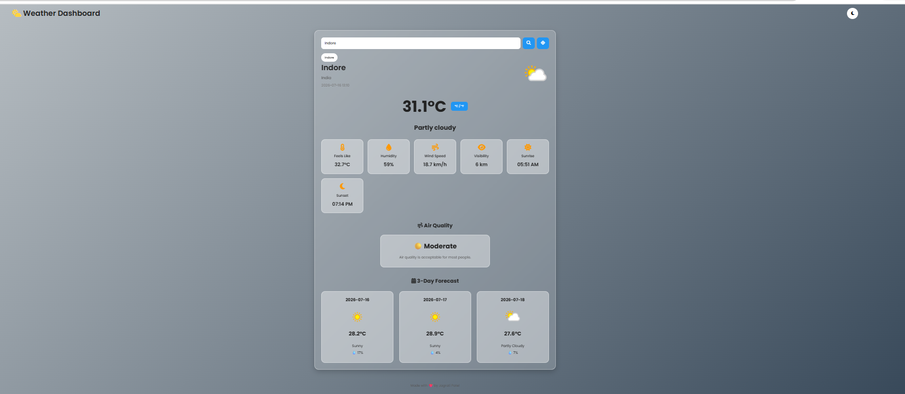

## 🚀 Live Demo

Check the live project here:

https://jagratipatel16.github.io/weather-dashboard/

# 🌦️ Weather Dashboard

A modern and responsive **Weather Dashboard** built using **HTML, CSS, and JavaScript**. The application fetches real-time weather data from **WeatherAPI** and displays current weather conditions, air quality status, sunrise & sunset timings, and a 3-day weather forecast.

---

## 📸 Screenshot




---

## ✨ Features

- 🔍 Search weather by city name
- 📍 Get weather using current location
- 🌡️ Current temperature (°C / °F toggle)
- ☁️ Weather condition with icon
- 💧 Humidity
- 🌬️ Wind Speed
- 👀 Visibility
- 🌅 Sunrise & Sunset timings
- 🌿 Air Quality Status with health message
- 📅 3-Day Weather Forecast
- 🌙 Dark / Light Mode
- 🕘 Search History (Local Storage)
- 📱 Fully Responsive Design
- 🎨 Modern Glassmorphism UI
- ⏳ Loading Spinner
- ❌ Error Handling for invalid city names

---

## 🛠️ Technologies Used

- HTML5
- CSS3
- JavaScript (ES6)
- WeatherAPI
- Font Awesome
- Google Fonts

---

## 📂 Project Structure

```text
weather-dashboard/
│
├── index.html
├── style.css
├── script.js
├── README.md
└── screenshots/
      └── home.png
```

---

## 🚀 How to Run

1. Download or clone this repository.

2. Open the project folder.

3. Open **index.html** in your preferred web browser.

4. Get a free API key from **WeatherAPI**.

5. Open **script.js** and replace:

```javascript
const API_KEY = "YOUR_API_KEY";
```

with your own API key.

6. Save the file and refresh the browser.

---

## 🌐 API Used

This project uses **WeatherAPI** to fetch real-time weather information.

Website:
https://www.weatherapi.com/

---

## 📊 Information Displayed

- City & Country
- Local Time
- Temperature
- Weather Condition
- Feels Like Temperature
- Humidity
- Wind Speed
- Visibility
- Sunrise
- Sunset
- Air Quality Status
- 3-Day Forecast

---

## 🔮 Future Improvements

- 🌧️ Hourly Forecast
- 📈 Weather Charts
- ⭐ Favorite Cities
- 🌎 Multiple Language Support
- 🔔 Weather Alerts
- 🛰️ Interactive Weather Maps

---

## 👩‍💻 Author

**Jagrati Patel**

- MCA Student, National Institute of Technology (NIT) Patna
- GitHub: https://github.com/Jagratipatel16

